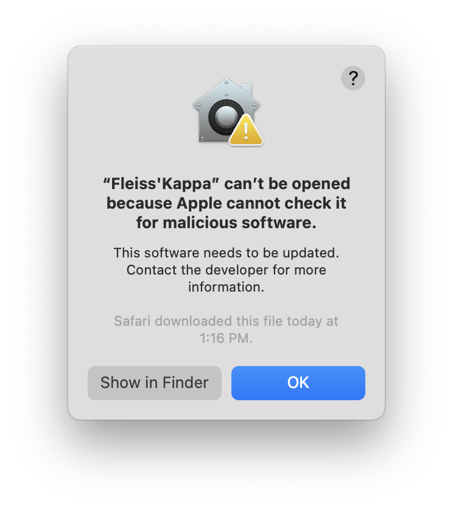
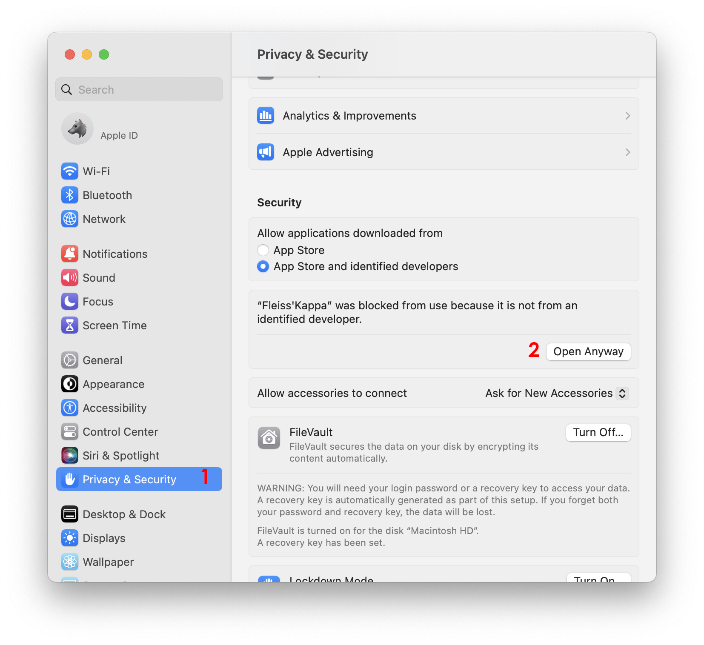
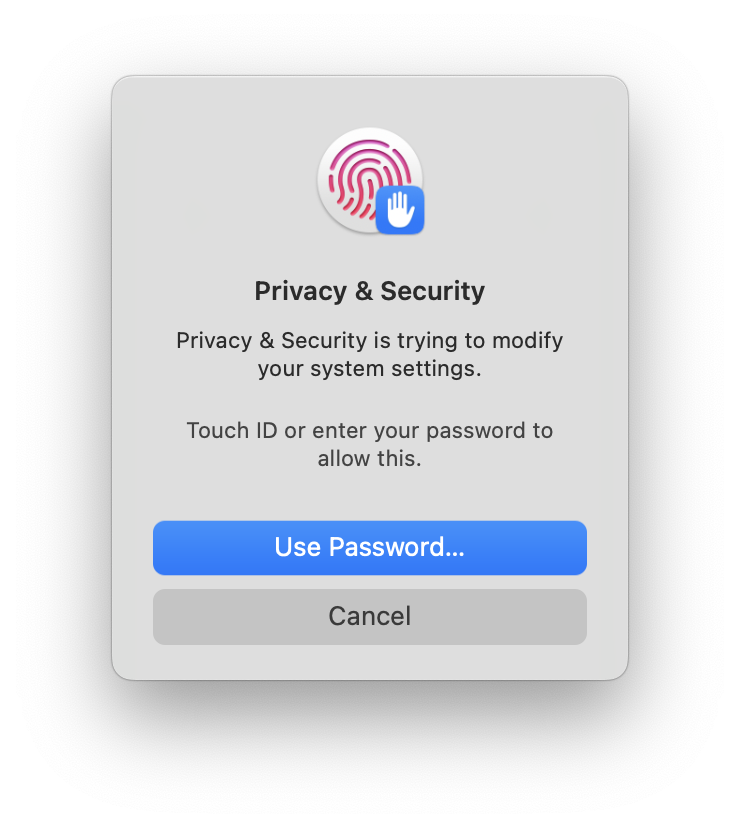
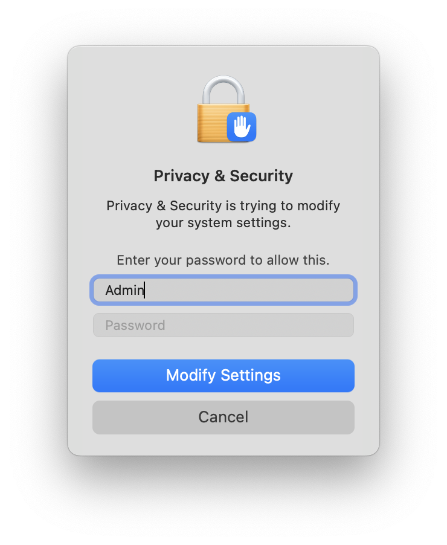
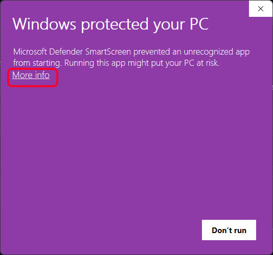
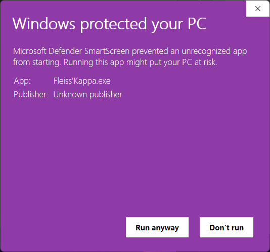

# Fleiss Kappa Calculator

## Description
This code is a Python script that calculates Fleiss Kappa, a statistical measure of inter-rater agreement, on data from an Excel file.

## Instructions
- Click the 'Select File' button to choose an Excel file. Note only .xlsx,.xlsm,.xltx,.xltm are accepted.
- Make sure the sheet inside the excel sheet is called 'RawData'.
- The program should then automatically calculate Fleiss Kappa and display it in the window.

## Windows and Mac Installation instruction:

[Windows Installation Instructions](# How to run on MAC OS: )

[Mac Installation Instructions](## How to run on Windows: )

## Dependencies
- base64
- openpyxl
- webbrowser
- tkinter
- matplotlib

## Scoring Convention for Fleiss Kappa
- < 0 Poor agreement
- 0.01 - 0.20 Slight agreement
- 0.21 - 0.40 Fair agreement
- 0.41 - 0.60 Moderate agreement
- 0.61 - 0.80 Substantial agreement
- 0.81 - 1.00 Almost perfect agreement

## Additional Features
- The code has a button that opens the developer's website
- The code has a button that opens the Wikipedia page on Fleiss Kappa
- The code has a button that opens the Github page of the developer

## Fleiss Kappa

Fleiss' kappa is a statistical measure for assessing the reliability of agreement between multiple raters when assigning categorical ratings to items. It compares the degree of agreement to what would be expected by chance. It can be used with binary or nominal-scale data, and can also be applied to ordinal data, but it is important to note that other measures such as Kendall's coefficients may be more appropriate for ordinal data. More information can be found on the Wikipedia page.

More information can be found here
https://en.wikipedia.org/wiki/Fleiss%27_kappa#:~:text=Fleiss%27%20kappa%20(named%20after%20Joseph,of%20items%20or%20classifying%20items.

## How to run on MAC OS: 

## How to run on Windows: 

