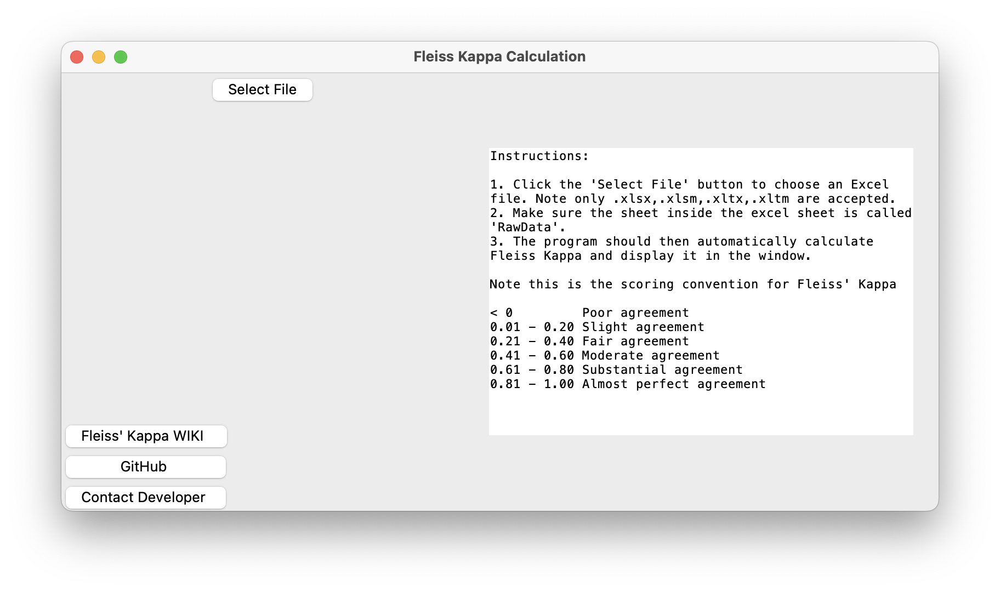
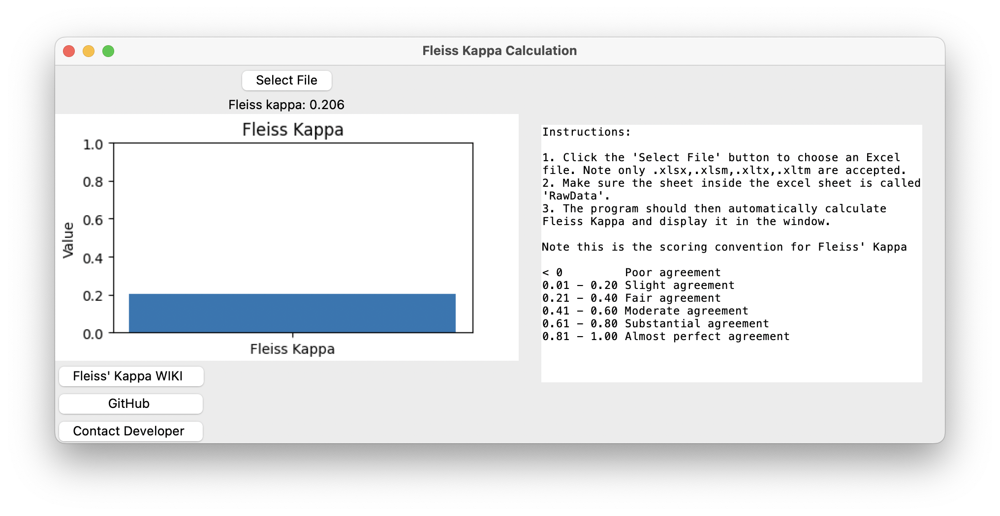
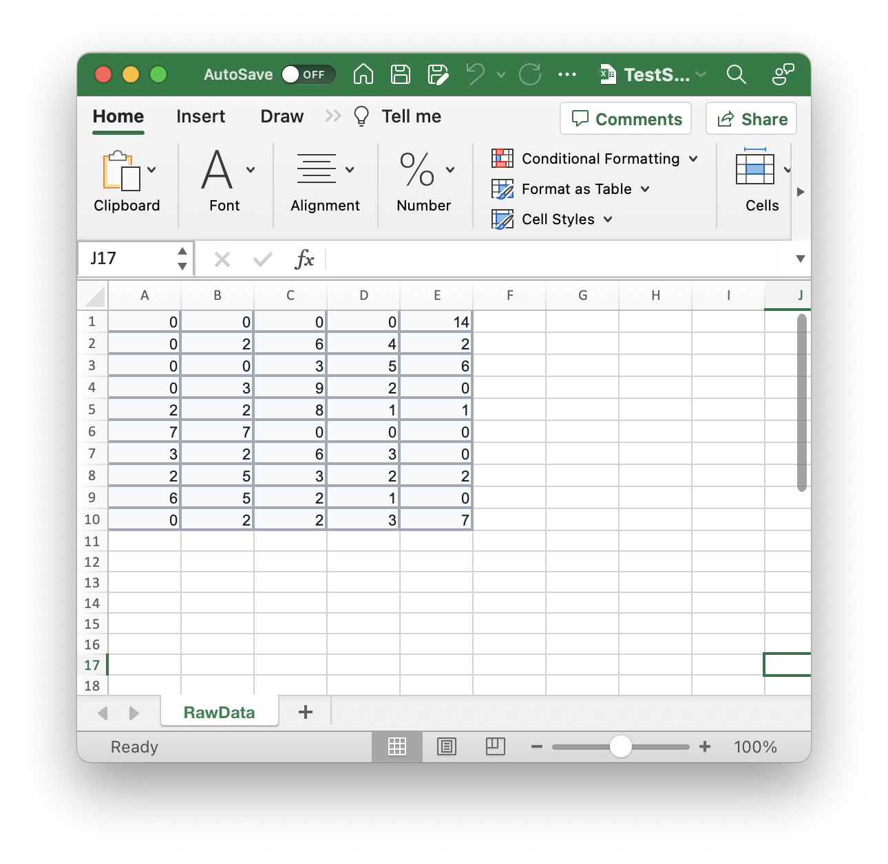
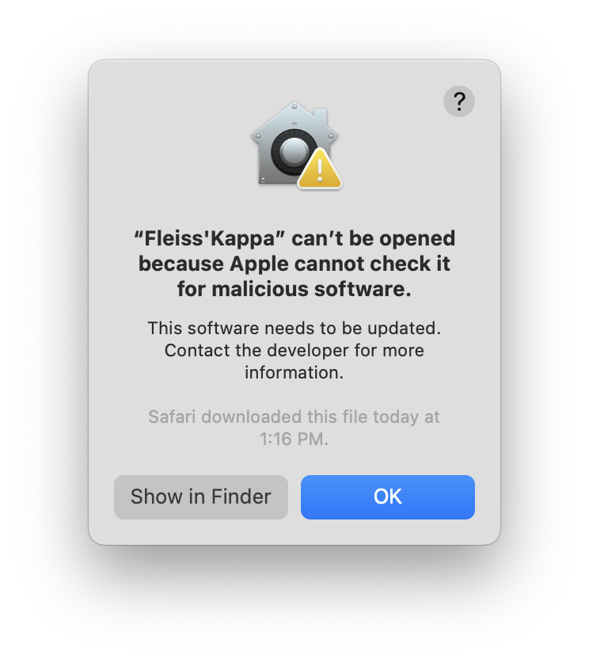
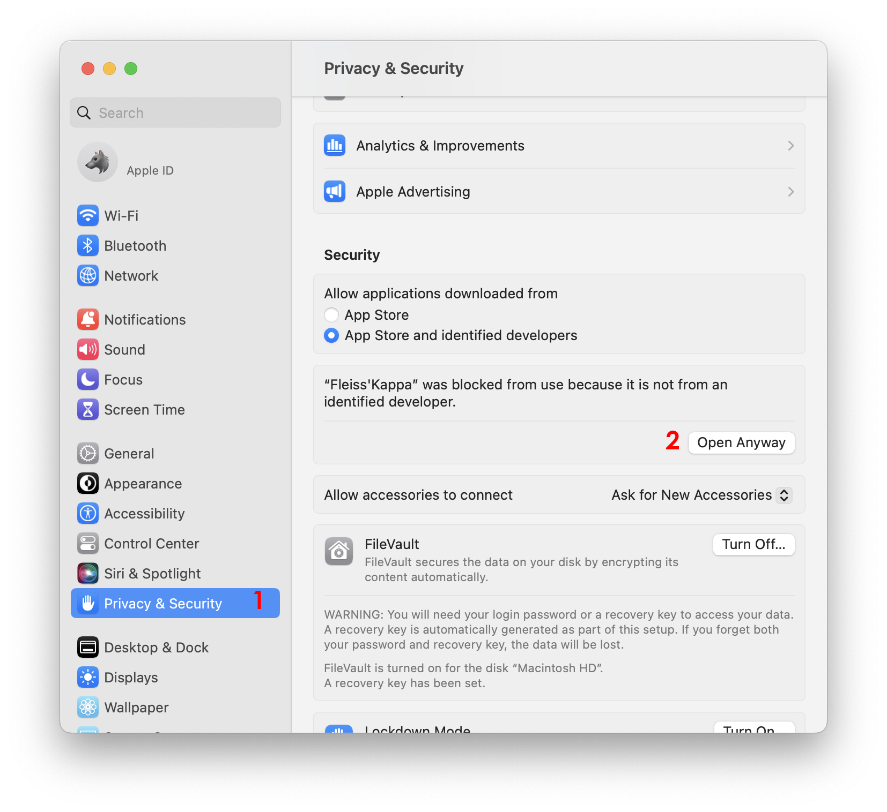
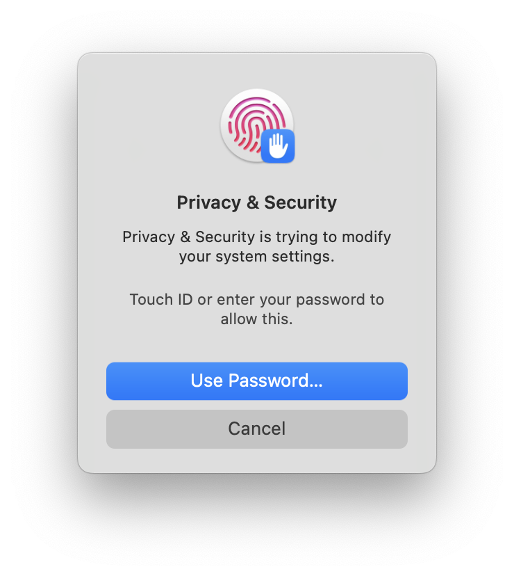
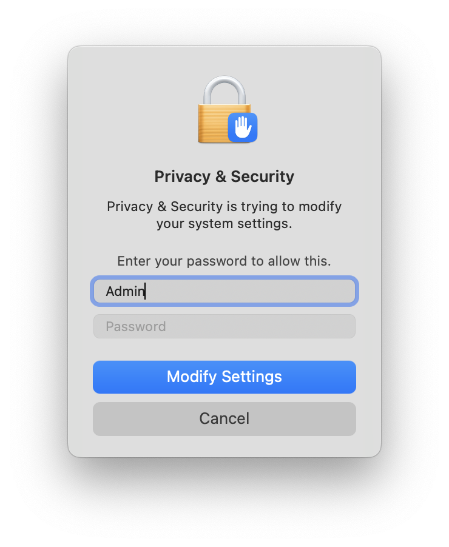
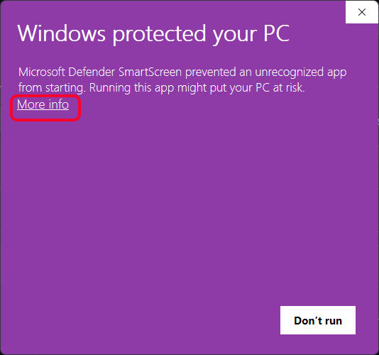
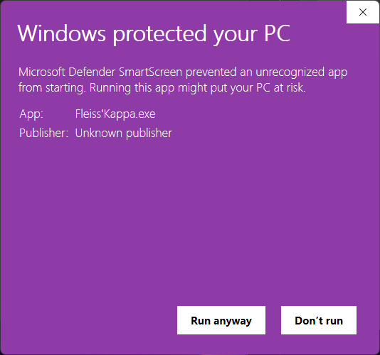

# Fleiss' Kappa Calculator

## Description

This code is a Python script that calculates Fleiss' Kappa, a statistical measure of inter-rater agreement, on data from an Excel file.

## Table Of Contents:
-[Fleiss' Kappa](https://github.com/Christian-TechUCM/Fleiss-Kappa#fleiss-kappa)

-[Scoring Convention for Fleiss' Kappa](https://github.com/Christian-TechUCM/Fleiss-Kappa#scoring-convention-for-fleiss-kappa)

-[Windows and Mac Installation instruction:](https://github.com/Christian-TechUCM/Fleiss-Kappa#windows-and-mac-installation-instruction)

-[GUI](https://github.com/Christian-TechUCM/Fleiss-Kappa#gui)

-[Formatting the Excel Sheet](https://github.com/Christian-TechUCM/Fleiss-Kappa#formatting-the-excel-sheet)

-[Dependencies](https://github.com/Christian-TechUCM/Fleiss-Kappa#dependencies)

-[Additonal Features](https://github.com/Christian-TechUCM/Fleiss-Kappa#additional-features)

-[How to run on MAC OS:](https://github.com/Christian-TechUCM/Fleiss-Kappa#how-to-run-on-mac-os)

-[How to run on Windows:](https://github.com/Christian-TechUCM/Fleiss-Kappa#how-to-run-on-windows)

## Fleiss' Kappa

Fleiss' kappa is a statistical measure for assessing the reliability of agreement between multiple raters when assigning categorical ratings to items. It compares the degree of agreement to what would be expected by chance. It can be used with binary or nominal-scale data, and can also be applied to ordinal data, but it is important to note that other measures such as Kendall's coefficients may be more appropriate for ordinal data. More information can be found on the Wikipedia page.

More information can be found [here.](https://en.wikipedia.org/wiki/Fleiss%27_kappa)

## Scoring Convention for Fleiss' Kappa

- < 0 Poor agreement
- 0.01 - 0.20 Slight agreement
- 0.21 - 0.40 Fair agreement
- 0.41 - 0.60 Moderate agreement
- 0.61 - 0.80 Substantial agreement
- 0.81 - 1.00 Almost perfect agreement

## Windows and Mac Installation instruction:

-[Mac Installation](https://github.com/Christian-TechUCM/Fleiss-Kappa#how-to-run-on-mac-os)

-[Windows Installation](https://github.com/Christian-TechUCM/Fleiss-Kappa#how-to-run-on-mac-os)

If you would like to run this program in the terminal Make sure to install the [dependencies](https://github.com/Christian-TechUCM/Fleiss-Kappa#dependencies). The Main py file can be found [here.](Fleiss'kappa/Windows/Main.py)

## GUI:

The Gui provides instructions on what types of files are accepted and how to use it.
Here is a test file for the program: [TestFile](https://github.com/Christian-TechUCM/Fleiss-Kappa/raw/main/Fleiss'kappa/Assets/TestFiles/TestSheet.xlsx). These numbers are from the example on the WIKI.

### Instructions

- Click the 'Select File' button to choose an Excel file. Note only .xlsx,.xlsm,.xltx,.xltm are accepted.
- Make sure the sheet inside the excel sheet is called 'RawData'.
- The program should then automatically calculate Fleiss Kappa and display it in the window.

Once this file is selected the user should see a screen like this.

The Program Calculates the percentage and prints out a graph.

## Formatting the Excel Sheet

When Creating the excel sheet the sheet name must be "Raw Data"
From there we can input data from the sheet.
Note The categories are presented in the columns, while the subjects are presented in the rows.

## Dependencies

- base64
- openpyxl
- webbrowser
- tkinter
- matplotlib

## Additional Features

- The code has a button that opens the developer's website
- The code has a button that opens the Wikipedia page on Fleiss' Kappa
- The code has a button that opens the Github page of the developer

## How to run on MAC OS:

[Mac Download](https://github.com/Christian-TechUCM/Fleiss-Kappa/raw/main/Fleiss'kappa/MacOS/dist/Fleiss'Kappa.zip)

When you first try to open the app you will be prompted with this message.

To get around this open settings, then open "Privacy & Security", Lastly click "Open Anyway".

Click on "Use Password".

Enter your credentials and the application should now be able to open the app.

## How to run on Windows:

[Windows Download](https://github.com/Christian-TechUCM/Fleiss-Kappa/raw/main/Fleiss'kappa/Windows/output/Fleiss'Kappa.exe)

When You try to open the app on windows you will be promted with this message.

To Bypass this click on "More Info" then click "Run anyway"

